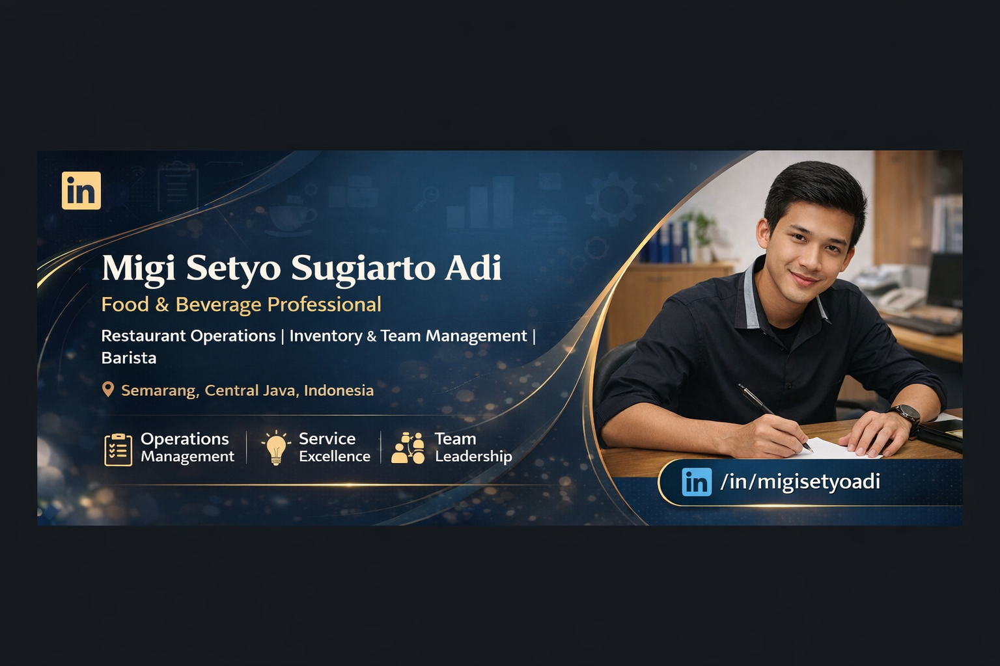

<html lang="id">
<head>
    <meta charset="UTF-8">
    <meta name="viewport" content="width=device-width, initial-scale=1.0">
    <title>Migi Setyo Sugiarto Adi | Professional Portfolio</title>
    <link href="https://fonts.googleapis.com/css2?family=Inter:wght@400;500;600;700&display=swap" rel="stylesheet">
    
</head>
<body>

    

        

            
        

        

            

                
in Professional Portfolio

                <h1>Migi Setyo Sugiarto Adi</h1>
                
📍 Semarang, Central Java | Indonesia

            

            

                

                    <h3>Executive Summary</h3>
                    
Profesional Food & Beverage dengan pengalaman lebih dari 5 tahun di bidang operasional restoran dan manajemen toko. Teruji dalam manajemen inventory, cost control, dan kepemimpinan tim.

                

                

                    <h3>Professional Objective</h3>
                    
Tujuan Karier: Berkontribusi dalam efisiensi operasional dan pertumbuhan bisnis melalui posisi manajemen strategis di industri F&B.

                

            

            Actions
            

                <a href="Migi Setyo Sugiarto Adi (10).pdf" class="btn btn-download" download>
                    DOWNLOAD CV PDF
                </a>
                
                <a href="https://wa.me/628112683668?text=Halo%20Migi,%20saya%20melihat%20profil%20Anda%20dan%20tertarik%20untuk%20berdiskusi." 
                   class="btn btn-whatsapp" target="_blank">
                    WHATSAPP
                </a>
            

        

    

</body>
</html>
